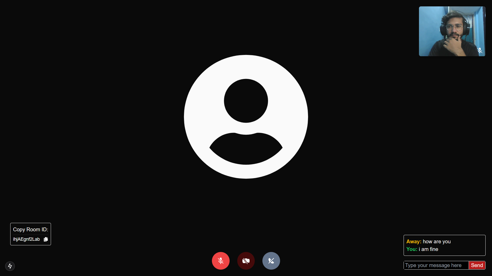
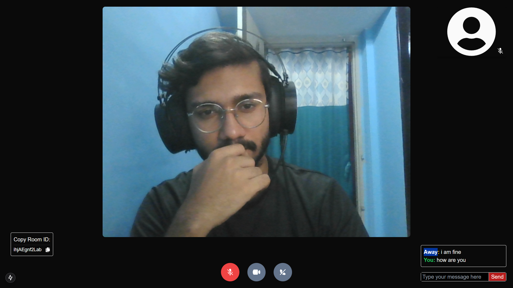

# Connectly (Peer-to-Peer Video Chat)

Connectly is a peer-to-peer video calling platform built using Next.js, Express.js (as a signaling server), Socket.IO, PeerJS, and Tailwind CSS. The project is entirely written in TypeScript and organized as a Turbo Repo with separate frontend and backend applications.

## Project Overview

Connectly allows users to initiate peer-to-peer video calls and exchange messages in real-time. It provides a seamless user experience with modern web technologies.

## Technologies Used

- TurboRepo
- Next.js
- Tailwind CSS
- TypeScript
- Socket.IO
- Express.js
- PeerJS

## Project Structure

```bash
turbo.json
apps/
  ├── frontend/       # Next.js frontend code
  └── backend/        # Express.js backend (signaling server) code
```

## How to Run

### Prerequisites

- Node.js (v14+)
- npm or yarn

### Steps to Run

1. Clone the repository:

```bash
git clone https://github.com/SyedFaizan8/Connectly.git
cd Connectly
```

2. Install dependencies:

```bash
cd apps/frontend    # Navigate to frontend directory
npm install

cd apps/backend     # Navigate to backend directory
npm install
```

3. Start the applications:

- Frontend (Next.js):

```bash
cd apps/frontend
npm run dev
```

- Backend (Express.js):

```bash
cd apps/backend
npm run dev
```

4. Access the application:

- Open your browser and go to http://localhost:3000 to access the Connectly application

## Project Architecture

### Architecture


### Sequence Diagram


## Screenshots

### Home Page


### When Both Connected


### When Camera Turned Off and Mic off and texting




---

Feel free to explore the code, learn from it, and reach out if you have any feedback or questions!

## License

[MIT License](LICENSE)
